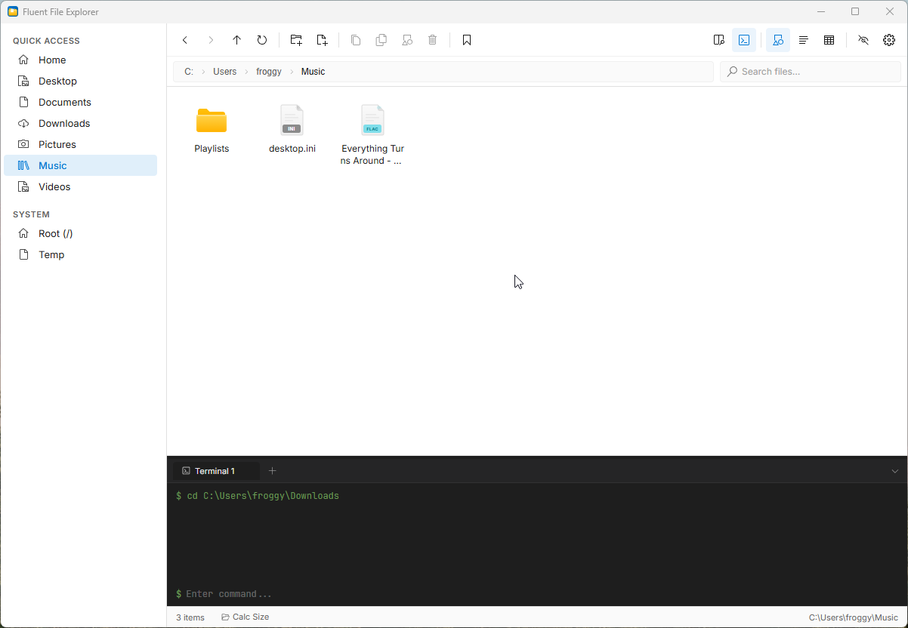
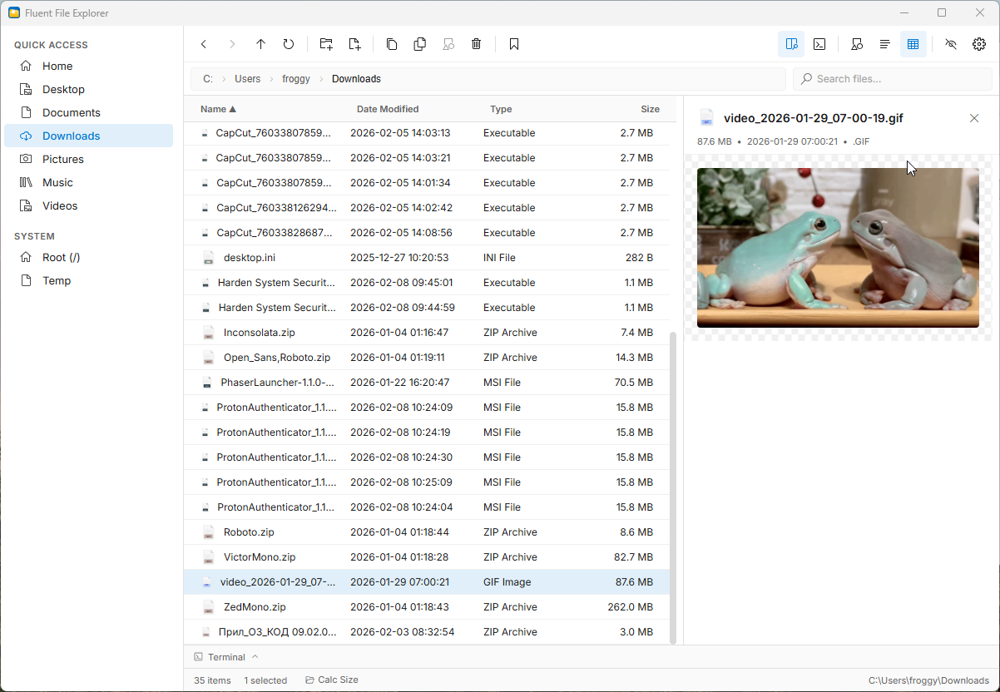
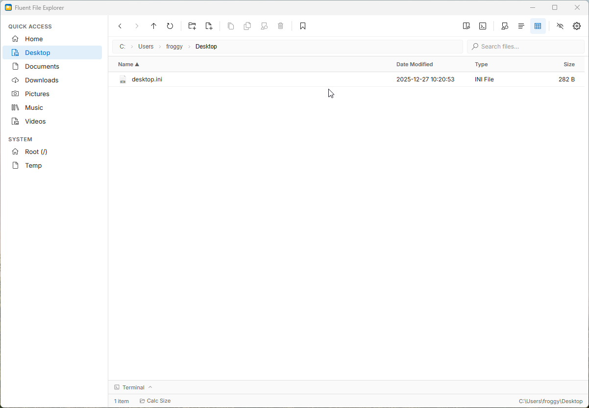

# Fluent File Explorer

A modern, fluent desktop file manager built with **Tauri v2**, **React 18**, and **TypeScript**.

Support both Windows & Linux

---

## Showcase

### List View
> Clean, detailed file listing with sortable columns

---

### Preview Panel
> Inline file preview with support for 20+ formats

---

### Grid View & Built-in Terminal
> Visual grid layout with integrated terminal panel

